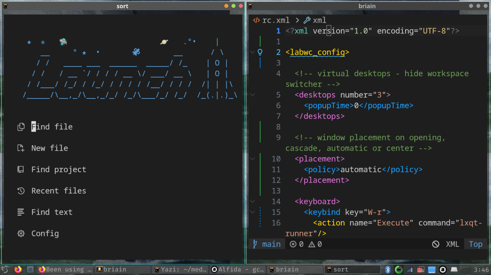
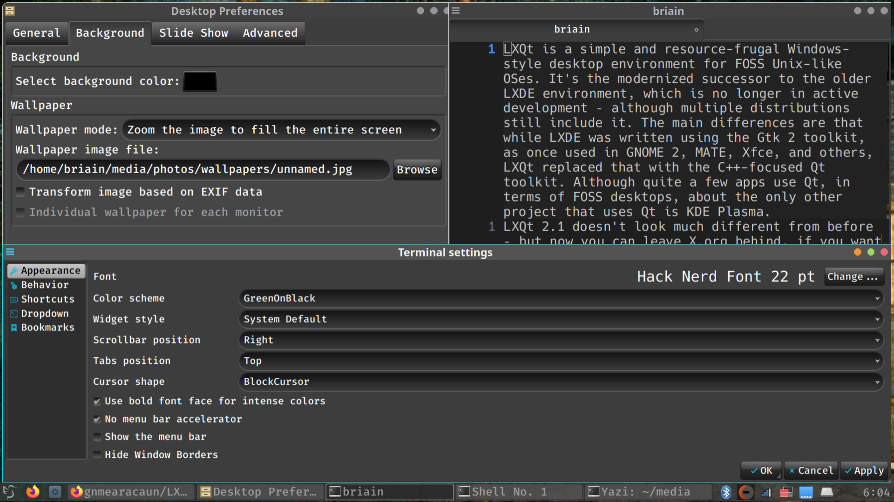
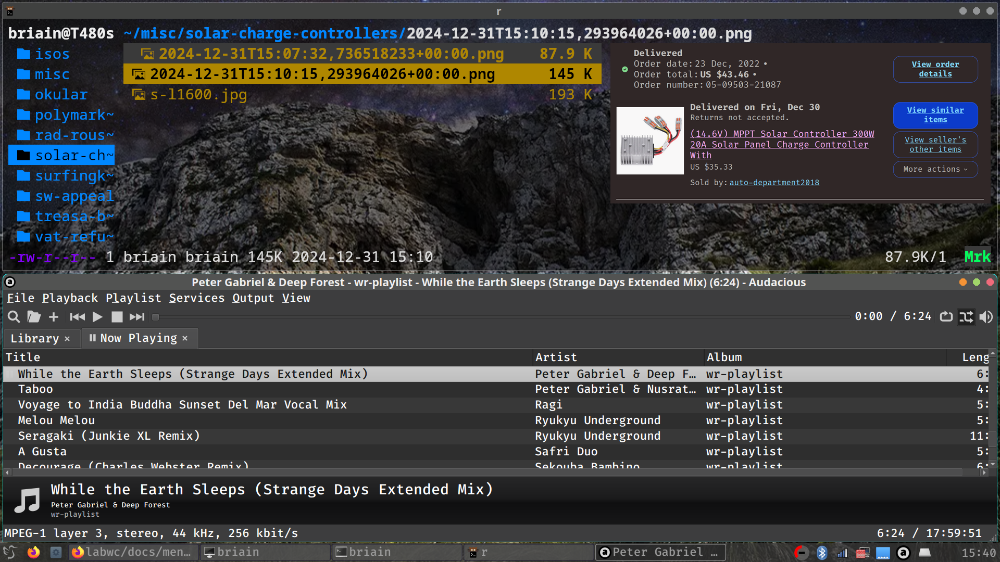

# LXQt-LabWC

Config for running Labwc (Window Manager) in an LXQt (Wayland) session.

Originally I was running Endeavour OS (Arch Linux) + Sway, and subsequently Hyprland & Wayfire (Wayland Window Compositors). When Raspberry Pi switched switched from Wayfire to LabWC in their Bookworm release (Oct 24) I decided to take the leap on my laptop as well as on the Pi.  

Labwc is a wlroots-based stacking compositor for wayland. It is light-weight and independent with a focus on simply stacking windows well and rendering some window decorations. It relies on clients for panels, screenshots, wallpapers and so on to create a full desktop environment. It's inspired by openbox and made by the creators of BunsenLabs (Debian + Openbox-based distro). 

LXQt 2.1, released in November 2024, offers the option to run LabWC, as one of several Wayland compositors within LXQt itself. Instead of having to set up a bar etc. separately you get lxpanel and lxqt-runner and labwc-tweaks and other LXQt desktop components. Some (not all) setting can be made in LXQt Configuration Center. In general, you'll want to poke around in the menu and read [the docs]( https://labwc.github.io/index.html).

Users can select the Wayland session (“LXQt (Wayland)”) from the SDDM login manager and choose `labwc` in LXQt Session Settings > Wayland Settings > Wayland compositor. 

To install LXQt and LabWC:
```
sudo pacman -S lxqt lxqt-config lxqt-policykit lxqt-powermanagement labwc labwc-tweaks 
```

I drew my configs, theme and other elements from various sources including https://github.com/stefonarch. His Vent-dark theme belongs in `~/.local/share/themes/` (& can also be specified via `labwc-tweaks`)






