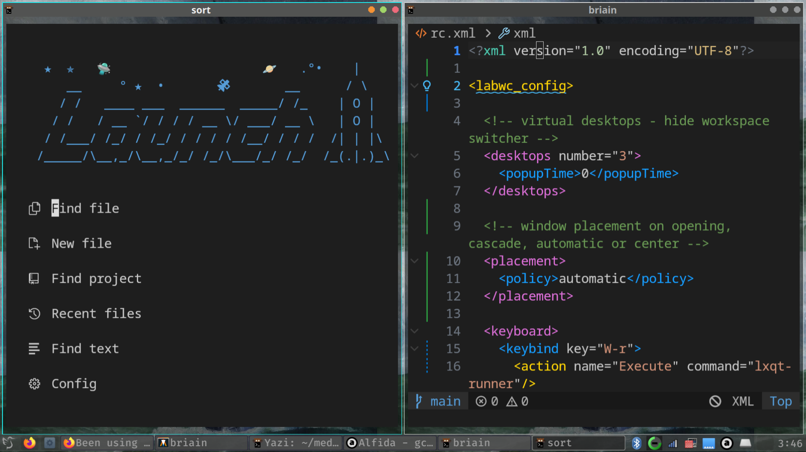
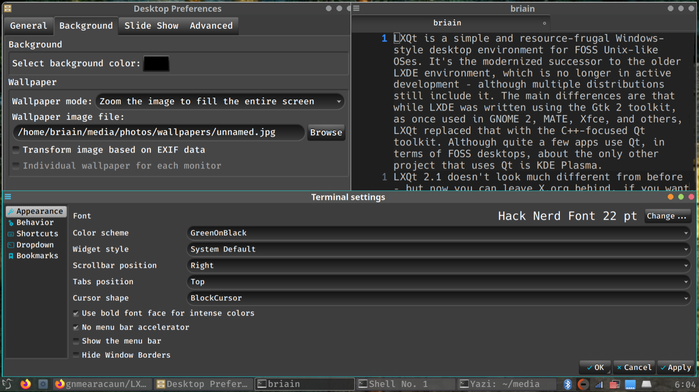
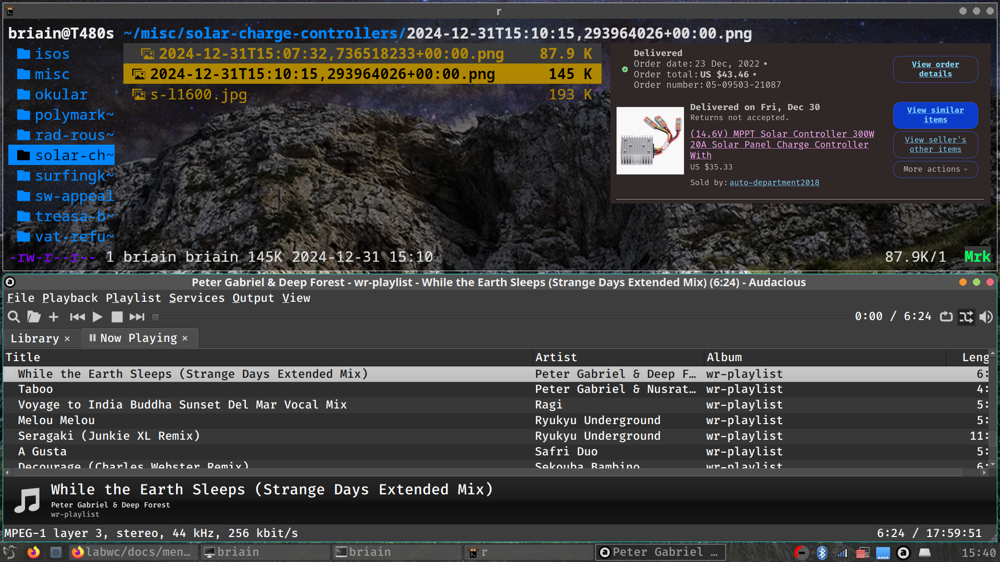

# LXQt-LabWC

My config for running Labwc (Window Manager) in an LXQt (Wayland) session.

With the advent of >= LXQt 2.1 you can choose any of several Wayland compositors within LXQt to manage the windows whereas LXQt takes care of powermanagement, theming etc. providing lxpanel (bar) and lxqt-runner (launcher) and other LXQt desktop utilities. Some (not all) settings can be made in LXQt Configuration Center. Here's the [wiki]( https://github.com/lxqt/lxqt/wiki).

When Raspberry Pi switched from Wayfire WM to LabWC in their Bookworm release (Oct '24) I decided use it on my laptop as well. [Labwc](https://labwc.github.io/index.html) is a wlroots-based stacking compositor. Inspired by BunsenLabs (lightweight Debian + Openbox-based distro), it takes a no-frills approach to focus on stacking windows well and rendering some window decorations. The dark window dressing and some other elements of my config are thanks to https://github.com/stefonarch among other sources. 

Once installed, users can select `/usr/bin/labwc` in LXQt Session Settings > Wayland Settings > Wayland compositor. Login to (“LXQt (Wayland)”) from the (SDDM) display manager. 

If you didn't choose LXQt initially, install:
```
lxqt lxqt-config lxqt-policykit lxqt-powermanagement lxqt-wayland-session 
```

Don't forget to grab `labwc` and `playerctl` for media-player shortcuts.









### Other things I do when I set up a new build

#### _Caps2esc_ and _Space2meta_

- Window managers typically make liberal use of the `super` key to move around. [space2meta](https://gitlab.com/interception/linux/plugins/space2meta): _turns your space key into the meta (a.k.a. super) key when chorded to another key_. 

- [caps2esc](https://gitlab.com/interception/linux/plugins/caps2esc): _transforming the most useless key ever into the most useful one_ `<Caps_lock>` is `esc` when tapped and `ctrl` when held down with another key. 

`Caps2esc` is available in the repo, however `space2meta` needs to be built manually.

```
sudo apt-get update
sudo apt-get install cmake ninja-build interception-caps2esc interception-tools interception-tools-compat 
git clone https://gitlab.com/interception/linux/plugins/space2meta.git
cd space2meta
cmake -Bbuild
cmake --build build
sudo mv build/space2meta /usr/local/bin  
cd .. && rm -r space2meta
```
Clone this very repo, put the udevmon config in place, and enable and start the service (you may have to logout/login to get the effect). 

```
git clone https://github.com/gnmearacaun/rpios-wayfirewm-config.git
cd rpios-wayfirewm-config
sudo mkdir -p /etc/interception/udevmon.d
sudo mv udevmon.yaml /etc/interception/udevmon.d/
sudo systemctl enable --now udevmon.service
```

The following command increases the priority. 

```
sudo nice -n -20 udevmon -c udevmon.yaml >udevmon.log 2>udevmon.err &
```

#### Zsh and Zap

To set zsh as your default shell, execute the following.
```
sudo sh -c "echo $(which zsh) >> /etc/shells" && chsh -s $(which zsh)
```
Log out and back in. You're prompt will be basic. Install [zap](https://github.com/zap-zsh/zap) zsh plugin manager (replaces the need for `oh-my-zsh`)
```
sudo apt-get install zsh zoxide
zsh <(curl -s https://raw.githubusercontent.com/zap-zsh/zap/master/install.zsh) --branch release-v1
```
Reopen the shell, `zap` automajically installs the default plugins. Plugins can be found on the [Zap homepage](https://www.zapzsh.com/) 

#### [Nerdfonts](https://github.com/getnf/getnf)

Often required by modern shell programs like zsh and neovim.

```
curl -fsSL https://raw.githubusercontent.com/getnf/getnf/main/install.sh | bash
```
Run `getnf` in the terminal and follow the prompts.

The fonts you select will be available system-wide.

#### A Minimal Vim Configuration 

I use a simple config (no plugins) authored by [jdhao](https://github.com/jdhao) while I'm  setting thing up and before neovim is built. It's also useful for occasional editing as `sudo`.

- The package `vim-gtk3` has better clipboard support than `vim` proper. Wayland users need `wl-clipboard` to copy and paste (both were installed with the previous `apt-get` command). 

```
sudo apt-get install vim-gtk3 wl-clipboard 
mv ~/.vimrc ~/.vimrc.bak
mkdir -p ~/.vim && cd ~/.vim
git clone https://github.com/jdhao/minimal_vim.git .
cd && sudo cp -r .vim /root
```
- Tip: add the following line to your `init.vim` to yank to `wl-clipboard`. So you would visually highlight the text with `v` or `shift+v` and the motion keys `h,j,k,l` and press `<leader>` (it's mapped to the `<spacebar>`) and then `y` to copy. Most terminals have `Ctrl+Shift+v` as the paste command. 
```
xnoremap <silent> <leader>y y:call system("wl-copy --trim-newline", @*)<cr>:call system("wl-copy -p --trim-newline", @*)<cr>
```


#### Build the Latest Neovim 

To use the awesome [LazyVim](https://www.lazyvim.org/installation) config we need a newer version of Neovim than Trixie offers. 

- Note `CMAKE_BUILD_TYPE=RelWithDebInfo` would make a build with Debug info. `Release` runs a bit lighter.

- Use `git checkout nightly` if you need the very latest.

```
sudo apt-get install ninja-build gettext cmake unzip curl build-essential ripgrep fd-find fzf wl-clipboard 
git clone https://github.com/neovim/neovim.git
git checkout stable 
make CMAKE_BUILD_TYPE=Release
cd build && sudo cpack -G DEB && sudo dpkg -i nvim-linux64.deb
nvim -V1 -v

```

Now that Neovim is available, make it the default in your `.zshrc`

```
export EDITOR="nvim"
```

Tip: Un/comment lines easily with (`gcc`). I often open nvim just to find a file on my system or to `grep` for a keyword.

#### Install nodejs 

I think this may be necessary for neovim. Utilizing [nodesource](https://github.com/nodesource/distributions), run as root:

```
sudo su
curl -fsSL https://deb.nodesource.com/setup_21.x | bash - &&\
apt-get install -y nodejs
```

#### Upgrading Neovim

Later when you want to upgrade, go back into the neovim directory (wherever it's stashed). Assuming you're on the branch you want, to rebuild from scratch and replace the current build:

```
git pull
sudo make distclean && make CMAKE_BUILD_TYPE=Release
cd build && sudo cpack -G DEB && sudo dpkg -i nvim-linux64.deb
nvim -V1 -v
```

#### Rebuilding Neovim

In case you have previously built the image and want to switch branches:
```
cd neovim && sudo cmake --build build/ --target uninstall
```

Alternatively, just delete the CMAKE_INSTALL_PREFIX artifacts:
```
sudo rm /usr/local/bin/nvim
sudo rm -r /usr/local/share/nvim/
```

